# VISP/TASKER Sub-Agent Architecture

## AI Agent Spawning Reference for Claude Code

### Modular Development Breakdown

---

# Overview

This document breaks down the VISP/Tasker platform into discrete, independently-buildable modules designed for AI sub-agent spawning via Claude Code terminal.

**Design Philosophy**: TaskRabbit × Uber Hybrid

- TaskRabbit: Service marketplace, task categories, provider profiles
- Uber: Real-time tracking, dynamic pricing, SLA enforcement, on-call system

---

# Agent Naming Convention

```
AGENT-{LAYER}-{MODULE}-{NUMBER}
```

**Layers:**

- `FE` = Frontend (iOS/React Native)
- `BE` = Backend (Python/FastAPI)
- `DB` = Database (PostgreSQL schemas)
- `INT` = Integrations (External APIs)
- `INF` = Infrastructure (DevOps)

---

# 🔵 FRONTEND AGENTS (iOS/React Native)

## AGENT-FE-AUTH-001: Authentication Module

### Purpose

Handle user authentication, registration, and session management.

### Inputs

```yaml
design_reference: "Uber-style phone auth + TaskRabbit profile setup"
screens:
  - splash_screen
  - phone_input
  - otp_verification
  - profile_setup_customer
  - profile_setup_provider
  - login_success
```

### Outputs

```yaml
files:
  - src/screens/auth/SplashScreen.tsx
  - src/screens/auth/PhoneInputScreen.tsx
  - src/screens/auth/OTPVerificationScreen.tsx
  - src/screens/auth/ProfileSetupScreen.tsx
  - src/components/auth/PhoneInput.tsx
  - src/components/auth/OTPInput.tsx
  - src/services/authService.ts
  - src/store/authSlice.ts
```

### Dependencies

```yaml
depends_on: []
provides_to: ["AGENT-FE-NAV-002", "AGENT-BE-AUTH-001"]
```

### Spawn Command

```bash
claude "Build authentication module for iOS app with phone-based auth, OTP verification, and profile setup for both customers and providers. Use React Native with TypeScript. Design should be Uber-style clean with TaskRabbit's warm colors."
```

---

## AGENT-FE-NAV-002: Navigation & Tab Structure

### Purpose

Main app navigation, tab bar, and screen routing.

### Inputs

```yaml
design_reference: "Bottom tabs: Home, Search, Activity, Messages, Profile"
role_based_views:
  - customer_tabs
  - provider_tabs
  - dual_role_tabs
```

### Outputs

```yaml
files:
  - src/navigation/AppNavigator.tsx
  - src/navigation/AuthNavigator.tsx
  - src/navigation/CustomerTabNavigator.tsx
  - src/navigation/ProviderTabNavigator.tsx
  - src/navigation/types.ts
  - src/components/navigation/TabBar.tsx
```

### Dependencies

```yaml
depends_on: ["AGENT-FE-AUTH-001"]
provides_to: ["AGENT-FE-HOME-003", "AGENT-FE-SEARCH-004"]
```

### Spawn Command

```bash
claude "Build React Native navigation structure with role-based tab bars. Customers see: Home, Browse, Bookings, Messages, Profile. Providers see: Dashboard, Jobs, Earnings, Messages, Profile. Support users who are both."
```

---

## AGENT-FE-HOME-003: Customer Home Screen

### Purpose

Main entry point for customers to find services.

### Inputs

```yaml
design_reference: "Uber home with TaskRabbit category cards"
components:
  - location_bar
  - emergency_button (prominent, red)
  - category_grid (8-12 main categories)
  - recent_bookings
  - featured_providers
```

### Outputs

```yaml
files:
  - src/screens/customer/HomeScreen.tsx
  - src/components/home/LocationBar.tsx
  - src/components/home/EmergencyButton.tsx
  - src/components/home/CategoryGrid.tsx
  - src/components/home/CategoryCard.tsx
  - src/components/home/RecentBookings.tsx
  - src/components/home/FeaturedProviders.tsx
```

### Dependencies

```yaml
depends_on: ["AGENT-FE-NAV-002"]
provides_to: ["AGENT-FE-SEARCH-004", "AGENT-FE-EMERGENCY-005"]
```

### Spawn Command

```bash
claude "Build customer home screen with prominent emergency button (red, top section), 8-category service grid (Cleaning, Handyman, Plumbing, Electrical, HVAC, Moving, Painting, General), location bar, and recent bookings carousel. Uber-clean layout with TaskRabbit warmth."
```

---

## AGENT-FE-SEARCH-004: Service Search & Selection

### Purpose

Task/service search, filtering, and selection flow.

### Inputs

```yaml
design_reference: "TaskRabbit task selection flow"
screens:
  - category_detail
  - task_list (closed selection, NO free text)
  - task_detail
  - service_options
flow_rules:
  - closed_task_selection_only
  - level_based_filtering
  - auto_escalation_warnings
```

### Outputs

```yaml
files:
  - src/screens/search/CategoryDetailScreen.tsx
  - src/screens/search/TaskListScreen.tsx
  - src/screens/search/TaskDetailScreen.tsx
  - src/components/search/TaskCard.tsx
  - src/components/search/LevelBadge.tsx
  - src/components/search/EscalationWarning.tsx
  - src/services/taskService.ts
```

### Dependencies

```yaml
depends_on: ["AGENT-FE-HOME-003", "AGENT-BE-TASKS-002"]
provides_to: ["AGENT-FE-BOOKING-006"]
```

### Spawn Command

```bash
claude "Build service search flow with CLOSED task selection (no free text allowed for legal protection). Show categories → tasks with level indicators (L1-L4 badges). Include escalation warnings when user approaches regulated services. TaskRabbit card style."
```

---

## AGENT-FE-EMERGENCY-005: Emergency Flow (11 Screens)

### Purpose

Complete emergency service request flow with SLA display.

### Inputs

```yaml
design_reference: "Uber emergency + SLA guarantees"
screens:
  1: emergency_selection (closed cards only)
  2: risk_confirmation (mandatory checkbox)
  3: location_access
  4: sla_pricing_display
  5: matching_animation
  6: provider_assigned
  7: live_tracking
  8: service_start
  9: in_progress
  10: completion
  11: rating_closure
legal_requirements:
  - mandatory_checkboxes
  - sla_visible_always
  - pricing_acceptance_required
```

### Outputs

```yaml
files:
  - src/screens/emergency/EmergencyHomeScreen.tsx
  - src/screens/emergency/EmergencySelectionScreen.tsx
  - src/screens/emergency/RiskConfirmationScreen.tsx
  - src/screens/emergency/LocationAccessScreen.tsx
  - src/screens/emergency/SLAPricingScreen.tsx
  - src/screens/emergency/MatchingScreen.tsx
  - src/screens/emergency/ProviderAssignedScreen.tsx
  - src/screens/emergency/LiveTrackingScreen.tsx
  - src/screens/emergency/ServiceStartScreen.tsx
  - src/screens/emergency/InProgressScreen.tsx
  - src/screens/emergency/CompletionScreen.tsx
  - src/components/emergency/EmergencyCard.tsx
  - src/components/emergency/SLATimer.tsx
  - src/components/emergency/LegalCheckbox.tsx
  - src/components/emergency/DynamicPriceDisplay.tsx
```

### Dependencies

```yaml
depends_on: ["AGENT-FE-HOME-003", "AGENT-FE-TRACKING-007"]
provides_to: ["AGENT-BE-MATCHING-004", "AGENT-BE-SLA-005"]
```

### Spawn Command

```bash
claude "Build complete 11-screen emergency flow for iOS. Must include: closed card selection (NO free text), mandatory legal checkboxes, SLA timer always visible, dynamic pricing display, live map tracking, and legal closure statement. Uber tracking style with TaskRabbit trust badges."
```

---

## AGENT-FE-BOOKING-006: Standard Booking Flow

### Purpose

Non-emergency service booking with scheduling.

### Inputs

```yaml
screens:
  - datetime_selection
  - provider_list
  - provider_detail
  - booking_summary
  - payment_selection
  - confirmation
```

### Outputs

```yaml
files:
  - src/screens/booking/DateTimeScreen.tsx
  - src/screens/booking/ProviderListScreen.tsx
  - src/screens/booking/ProviderDetailScreen.tsx
  - src/screens/booking/BookingSummaryScreen.tsx
  - src/screens/booking/PaymentScreen.tsx
  - src/screens/booking/ConfirmationScreen.tsx
  - src/components/booking/ProviderCard.tsx
  - src/components/booking/LevelBadge.tsx
  - src/components/booking/VerificationBadges.tsx
  - src/components/booking/PricingBreakdown.tsx
```

### Dependencies

```yaml
depends_on: ["AGENT-FE-SEARCH-004"]
provides_to: ["AGENT-FE-TRACKING-007", "AGENT-BE-BOOKING-003"]
```

### Spawn Command

```bash
claude "Build standard booking flow with date/time selection, provider list with ratings and level badges, detailed provider profiles showing credentials, booking summary with legal checkboxes, and payment integration. TaskRabbit provider cards with Uber-style confirmation."
```

---

## AGENT-FE-TRACKING-007: Live Tracking & Job Progress

### Purpose

Real-time provider tracking and job status updates.

### Inputs

```yaml
components:
  - map_view (Google Maps/Mapbox)
  - provider_location_marker
  - eta_display
  - status_updates
  - contact_buttons (call, message)
  - sla_countdown (for emergencies)
```

### Outputs

```yaml
files:
  - src/screens/tracking/LiveTrackingScreen.tsx
  - src/screens/tracking/JobProgressScreen.tsx
  - src/components/tracking/MapView.tsx
  - src/components/tracking/ProviderMarker.tsx
  - src/components/tracking/ETADisplay.tsx
  - src/components/tracking/StatusTimeline.tsx
  - src/components/tracking/SLACountdown.tsx
  - src/components/tracking/ContactButtons.tsx
  - src/services/locationService.ts
  - src/services/websocketService.ts
```

### Dependencies

```yaml
depends_on: ["AGENT-FE-BOOKING-006", "AGENT-FE-EMERGENCY-005"]
provides_to: ["AGENT-FE-RATING-008"]
```

### Spawn Command

```bash
claude "Build live tracking screen with real-time map (react-native-maps), provider location updates via WebSocket, ETA display, status timeline (Accepted → En Route → Arrived → In Progress → Completed), and SLA countdown timer for emergencies. Uber tracking UX."
```

---

## AGENT-FE-RATING-008: Review & Rating System

### Purpose

Post-job rating and feedback collection.

### Inputs

```yaml
components:
  - star_rating (1-5)
  - category_ratings (optional: professionalism, skill, punctuality)
  - text_feedback
  - photo_upload (optional)
  - legal_acknowledgment
```

### Outputs

```yaml
files:
  - src/screens/rating/RatingScreen.tsx
  - src/components/rating/StarRating.tsx
  - src/components/rating/CategoryRatings.tsx
  - src/components/rating/FeedbackInput.tsx
  - src/components/rating/PhotoUpload.tsx
  - src/services/ratingService.ts
```

### Dependencies

```yaml
depends_on: ["AGENT-FE-TRACKING-007"]
provides_to: ["AGENT-BE-RATINGS-006"]
```

### Spawn Command

```bash
claude "Build rating screen with 5-star rating, optional category ratings (professionalism, skill, punctuality), text feedback, photo upload capability, and legal acknowledgment footer stating Tasker is platform intermediary. Clean, encouraging UX to maximize completion rate."
```

---

## AGENT-FE-PROVIDER-009: Provider Dashboard

### Purpose

Provider-facing interface for job management.

### Inputs

```yaml
screens:
  - provider_home (earnings, active jobs)
  - job_list (available, assigned, completed)
  - job_detail
  - earnings_overview
  - availability_settings
  - on_call_toggle (Level 4)
```

### Outputs

```yaml
files:
  - src/screens/provider/ProviderHomeScreen.tsx
  - src/screens/provider/JobListScreen.tsx
  - src/screens/provider/JobDetailScreen.tsx
  - src/screens/provider/EarningsScreen.tsx
  - src/screens/provider/AvailabilityScreen.tsx
  - src/screens/provider/OnCallSettingsScreen.tsx
  - src/components/provider/JobCard.tsx
  - src/components/provider/EarningsChart.tsx
  - src/components/provider/AvailabilityToggle.tsx
  - src/components/provider/OnCallScheduler.tsx
```

### Dependencies

```yaml
depends_on: ["AGENT-FE-NAV-002", "AGENT-FE-AUTH-001"]
provides_to: ["AGENT-BE-PROVIDER-007"]
```

### Spawn Command

```bash
claude "Build provider dashboard with earnings overview, job management (accept/reject/complete), availability toggle, and Level 4 on-call scheduling. Show SLA requirements for emergency providers. Uber driver app style with TaskRabbit job cards."
```

---

## AGENT-FE-PROFILE-010: Profile & Credentials

### Purpose

User profile management and credential uploads.

### Inputs

```yaml
screens:
  - profile_view
  - profile_edit
  - credentials_list (for providers)
  - document_upload
  - level_progress
  - verification_status
```

### Outputs

```yaml
files:
  - src/screens/profile/ProfileViewScreen.tsx
  - src/screens/profile/ProfileEditScreen.tsx
  - src/screens/profile/CredentialsScreen.tsx
  - src/screens/profile/DocumentUploadScreen.tsx
  - src/screens/profile/LevelProgressScreen.tsx
  - src/components/profile/ProfileHeader.tsx
  - src/components/profile/CredentialCard.tsx
  - src/components/profile/VerificationBadge.tsx
  - src/components/profile/LevelProgressBar.tsx
  - src/services/profileService.ts
```

### Dependencies

```yaml
depends_on: ["AGENT-FE-AUTH-001"]
provides_to: ["AGENT-BE-AUTH-001", "AGENT-BE-VERIFICATION-008"]
```

### Spawn Command

```bash
claude "Build profile management screens for both customers and providers. Providers see credential management, document uploads, level progression (L1→L2→L3→L4), and verification badges. Show background check status and insurance expiry warnings."
```

---

## AGENT-FE-MESSAGING-011: In-App Messaging

### Purpose

Real-time messaging between customers and providers.

### Inputs

```yaml
components:
  - conversation_list
  - chat_screen
  - message_bubbles
  - quick_actions (location sharing, ETA)
  - job_context_header
```

### Outputs

```yaml
files:
  - src/screens/messaging/ConversationListScreen.tsx
  - src/screens/messaging/ChatScreen.tsx
  - src/components/messaging/ConversationCard.tsx
  - src/components/messaging/MessageBubble.tsx
  - src/components/messaging/QuickActions.tsx
  - src/components/messaging/JobContextHeader.tsx
  - src/services/messagingService.ts
```

### Dependencies

```yaml
depends_on: ["AGENT-FE-NAV-002"]
provides_to: ["AGENT-BE-MESSAGING-009"]
```

### Spawn Command

```bash
claude "Build in-app messaging with conversation list, real-time chat via WebSocket, message bubbles with timestamps, quick actions for location/ETA sharing, and job context header showing current booking. Include keyword detection for escalation triggers."
```

---

## AGENT-FE-DESIGN-012: Design System & Components

### Purpose

Shared design tokens, theme, and reusable components.

### Inputs

```yaml
design_system:
  colors:
    primary: "#2D3436"      # Dark charcoal
    secondary: "#00B894"    # Teal (trust)
    accent: "#E17055"       # Warm coral
    emergency: "#E74C3C"    # Alert red
    background: "#F8F9FA"   # Light gray
    surface: "#FFFFFF"      # White
  typography:
    font_family: "Inter"
    scale: [12, 14, 16, 18, 24, 32, 48]
  spacing: [4, 8, 12, 16, 24, 32, 48]
  border_radius: [4, 8, 12, 16, 24]
```

### Outputs

```yaml
files:
  - src/theme/colors.ts
  - src/theme/typography.ts
  - src/theme/spacing.ts
  - src/theme/shadows.ts
  - src/theme/index.ts
  - src/components/ui/Button.tsx
  - src/components/ui/Card.tsx
  - src/components/ui/Input.tsx
  - src/components/ui/Badge.tsx
  - src/components/ui/Modal.tsx
  - src/components/ui/Avatar.tsx
  - src/components/ui/Icon.tsx
  - src/components/ui/LoadingSpinner.tsx
```

### Dependencies

```yaml
depends_on: []
provides_to: ["ALL_FE_AGENTS"]
```

### Spawn Command

```bash
claude "Build comprehensive React Native design system with color tokens, typography scale, spacing system, and reusable components (Button, Card, Input, Badge, Modal, Avatar). TaskRabbit warmth meets Uber cleanliness. Include dark mode support."
```

---

# 🟢 BACKEND AGENTS (Python/FastAPI)

## AGENT-BE-AUTH-001: Authentication Service

### Purpose

User authentication, JWT tokens, and session management.

### Inputs

```yaml
endpoints:
  - POST /auth/register
  - POST /auth/login/phone
  - POST /auth/verify-otp
  - POST /auth/refresh-token
  - POST /auth/logout
  - GET /auth/me
security:
  - phone_verification (Twilio)
  - jwt_tokens
  - refresh_token_rotation
```

### Outputs

```yaml
files:
  - app/api/v1/auth.py
  - app/services/auth_service.py
  - app/services/otp_service.py
  - app/schemas/auth.py
  - app/core/security.py
  - app/core/jwt.py
  - tests/test_auth.py
```

### Database Tables

```yaml
uses: ["users", "legal_consents"]
```

### Dependencies

```yaml
depends_on: ["AGENT-DB-CORE-001"]
provides_to: ["AGENT-BE-USERS-002", "AGENT-FE-AUTH-001"]
```

### Spawn Command

```bash
claude "Build FastAPI authentication module with phone-based auth, Twilio OTP verification, JWT access/refresh tokens with rotation, and session management. Include rate limiting and brute force protection. Follow OAuth2 patterns."
```

---

## AGENT-BE-TASKS-002: Task Catalog Service

### Purpose

Service taxonomy management and task matching.

### Inputs

```yaml
endpoints:
  - GET /categories
  - GET /categories/{id}/tasks
  - GET /tasks/{id}
  - GET /tasks/search
  - POST /tasks/check-level (internal)
business_rules:
  - closed_catalog_only
  - level_filtering
  - auto_escalation_detection
```

### Outputs

```yaml
files:
  - app/api/v1/tasks.py
  - app/services/task_service.py
  - app/services/escalation_service.py
  - app/schemas/tasks.py
  - app/models/tasks.py
  - tests/test_tasks.py
```

### Database Tables

```yaml
uses: ["service_categories", "service_tasks", "job_escalations"]
```

### Dependencies

```yaml
depends_on: ["AGENT-DB-TAXONOMY-002"]
provides_to: ["AGENT-BE-BOOKING-003", "AGENT-FE-SEARCH-004"]
```

### Spawn Command

```bash
claude "Build FastAPI service for task catalog with category listing, task filtering by level, keyword-based escalation detection (electrical, gas, plumbing triggers). Enforce closed catalog rule - no dynamic task creation. Include search with level visibility filtering."
```

---

## AGENT-BE-BOOKING-003: Booking & Job Service

### Purpose

Job creation, scheduling, and lifecycle management.

### Inputs

```yaml
endpoints:
  - POST /jobs
  - GET /jobs/{id}
  - PUT /jobs/{id}/status
  - GET /jobs/customer/{user_id}
  - GET /jobs/provider/{user_id}
  - POST /jobs/{id}/cancel
  - POST /jobs/{id}/complete
states:
  - DRAFT → REQUESTED → MATCHING → ASSIGNED
  - ASSIGNED → EN_ROUTE → ARRIVED → IN_PROGRESS
  - IN_PROGRESS → COMPLETED | CANCELLED | DISPUTED
```

### Outputs

```yaml
files:
  - app/api/v1/jobs.py
  - app/services/job_service.py
  - app/services/job_state_machine.py
  - app/schemas/jobs.py
  - app/models/jobs.py
  - tests/test_jobs.py
```

### Database Tables

```yaml
uses: ["jobs", "job_assignments", "legal_consents"]
```

### Dependencies

```yaml
depends_on: ["AGENT-DB-CORE-001", "AGENT-BE-TASKS-002"]
provides_to: ["AGENT-BE-MATCHING-004", "AGENT-BE-PAYMENT-010"]
```

### Spawn Command

```bash
claude "Build FastAPI job management service with state machine for job lifecycle, SLA snapshot capture at creation, legal consent logging, and proper status transitions. Include job cancellation with penalty calculation and completion with payout calculation."
```

---

## AGENT-BE-MATCHING-004: Provider Matching Engine

### Purpose

Intelligent provider matching based on level, location, and score.

### Inputs

```yaml
endpoints:
  - POST /matching/find (internal)
  - POST /matching/assign
  - POST /matching/reassign
matching_rules:
  - level_compatibility
  - geographic_proximity
  - internal_score_ranking
  - availability_status
  - credential_validation (L3+)
  - insurance_validation (L3+)
  - on_call_status (L4)
```

### Outputs

```yaml
files:
  - app/api/v1/matching.py
  - app/services/matching_service.py
  - app/services/geo_service.py
  - app/schemas/matching.py
  - tests/test_matching.py
```

### Database Tables

```yaml
uses: ["provider_profiles", "provider_levels", "provider_credentials", "provider_insurance_policies", "on_call_shifts"]
```

### Dependencies

```yaml
depends_on: ["AGENT-DB-PROVIDERS-003", "AGENT-BE-BOOKING-003"]
provides_to: ["AGENT-FE-BOOKING-006", "AGENT-FE-EMERGENCY-005"]
```

### Spawn Command

```bash
claude "Build provider matching engine with level-aware filtering, PostGIS geographic queries, internal score ranking, and real-time availability checking. Level 3+ requires valid credentials/insurance. Level 4 requires active on-call shift. Return ranked provider list."
```

---

## AGENT-BE-SLA-005: SLA Enforcement Service

### Purpose

SLA tracking, breach detection, and penalty enforcement.

### Inputs

```yaml
endpoints:
  - POST /sla/start-tracking/{job_id}
  - GET /sla/status/{job_id}
  - POST /sla/check-breach (internal, via Celery)
sla_metrics:
  - response_time (accept job)
  - arrival_time (arrive on site)
  - coverage_hours (for on-call)
penalties:
  - score_deduction
  - temporary_suspension
  - level_demotion
  - permanent_expulsion (L4 no-show)
```

### Outputs

```yaml
files:
  - app/api/v1/sla.py
  - app/services/sla_service.py
  - app/services/penalty_service.py
  - app/tasks/sla_monitoring.py
  - app/schemas/sla.py
  - tests/test_sla.py
```

### Database Tables

```yaml
uses: ["sla_profiles", "jobs", "job_assignments", "provider_profiles"]
```

### Dependencies

```yaml
depends_on: ["AGENT-BE-BOOKING-003", "AGENT-INF-CELERY-001"]
provides_to: ["AGENT-FE-EMERGENCY-005", "AGENT-FE-TRACKING-007"]
```

### Spawn Command

```bash
claude "Build SLA enforcement service with Celery background tasks for real-time monitoring. Track response/arrival times, detect breaches, apply penalties to internal score, and trigger auto-reassignment on breach. Level 4 no-show = immediate expulsion. Include SLA snapshot at job creation."
```

---

## AGENT-BE-RATINGS-006: Review & Rating Service

### Purpose

Rating collection, aggregation, and provider scoring.

### Inputs

```yaml
endpoints:
  - POST /ratings
  - GET /ratings/provider/{id}
  - GET /ratings/customer/{id}
aggregation:
  - average_rating
  - rating_count
  - weighted_by_level (L3+ ratings worth more)
internal_score_impact:
  - positive_review: +points
  - negative_review: -points
```

### Outputs

```yaml
files:
  - app/api/v1/ratings.py
  - app/services/rating_service.py
  - app/services/score_service.py
  - app/schemas/ratings.py
  - app/models/ratings.py
  - tests/test_ratings.py
```

### Database Tables

```yaml
uses: ["ratings", "provider_profiles"]
```

### Dependencies

```yaml
depends_on: ["AGENT-DB-CORE-001", "AGENT-BE-BOOKING-003"]
provides_to: ["AGENT-FE-RATING-008", "AGENT-BE-MATCHING-004"]
```

### Spawn Command

```bash
claude "Build rating service with review submission, weighted aggregation (L3+ jobs count more), internal score impact calculation, and provider leaderboard generation. Include fraud detection for suspicious rating patterns."
```

---

## AGENT-BE-PROVIDER-007: Provider Management Service

### Purpose

Provider profile, level management, and progression.

### Inputs

```yaml
endpoints:
  - GET /providers/{id}
  - PUT /providers/{id}
  - GET /providers/{id}/levels
  - POST /providers/{id}/levels/upgrade-request
  - PUT /providers/{id}/availability
  - POST /providers/{id}/on-call/start
  - POST /providers/{id}/on-call/end
level_progression:
  - L1 → L2: 20 jobs + 4.5+ rating
  - L2 → L3: License + Insurance verification
  - L3 → L4: SLA track record + emergency insurance
```

### Outputs

```yaml
files:
  - app/api/v1/providers.py
  - app/services/provider_service.py
  - app/services/level_service.py
  - app/schemas/providers.py
  - tests/test_providers.py
```

### Database Tables

```yaml
uses: ["provider_profiles", "provider_levels", "on_call_shifts"]
```

### Dependencies

```yaml
depends_on: ["AGENT-DB-PROVIDERS-003"]
provides_to: ["AGENT-FE-PROVIDER-009", "AGENT-BE-MATCHING-004"]
```

### Spawn Command

```bash
claude "Build provider management service with profile CRUD, level tracking and upgrade requests, availability status management, and on-call shift scheduling. Include level progression automation based on job count and ratings."
```

---

## AGENT-BE-VERIFICATION-008: Credential & Document Verification

### Purpose

License, insurance, and background check verification.

### Inputs

```yaml
endpoints:
  - POST /verification/credentials
  - POST /verification/insurance
  - POST /verification/background-check
  - GET /verification/status/{provider_id}
integrations:
  - background_check_api (Sterling, CRJMC.net)
  - document_ocr (optional)
  - expiry_tracking
```

### Outputs

```yaml
files:
  - app/api/v1/verification.py
  - app/services/verification_service.py
  - app/services/background_check_service.py
  - app/services/document_service.py
  - app/tasks/expiry_checker.py
  - app/schemas/verification.py
  - tests/test_verification.py
```

### Database Tables

```yaml
uses: ["provider_credentials", "provider_insurance_policies"]
```

### Dependencies

```yaml
depends_on: ["AGENT-DB-PROVIDERS-003", "AGENT-INT-STORAGE-003"]
provides_to: ["AGENT-FE-PROFILE-010", "AGENT-BE-MATCHING-004"]
```

### Spawn Command

```bash
claude "Build verification service for credentials, insurance policies, and background checks. Include S3 document upload, expiry date tracking with Celery reminders, and auto-suspension when documents expire. Support CRC, CRJMC, and VSC check types for Ontario."
```

---

## AGENT-BE-MESSAGING-009: Real-Time Messaging Service

### Purpose

In-app messaging with WebSocket support.

### Inputs

```yaml
endpoints:
  - GET /conversations
  - GET /conversations/{id}/messages
  - POST /conversations/{id}/messages
websocket:
  - WS /ws/chat/{conversation_id}
features:
  - real_time_delivery
  - read_receipts
  - keyword_detection (for escalation)
  - job_context_linking
```

### Outputs

```yaml
files:
  - app/api/v1/messaging.py
  - app/services/messaging_service.py
  - app/services/websocket_manager.py
  - app/schemas/messaging.py
  - app/models/conversations.py
  - tests/test_messaging.py
```

### Dependencies

```yaml
depends_on: ["AGENT-DB-CORE-001", "AGENT-INF-REDIS-002"]
provides_to: ["AGENT-FE-MESSAGING-011"]
```

### Spawn Command

```bash
claude "Build real-time messaging service with WebSocket support, conversation/message models, read receipts, and keyword detection for escalation triggers. Link messages to job context for support visibility."
```

---

## AGENT-BE-PAYMENT-010: Payment Processing Service

### Purpose

Payment processing, payouts, and commission calculation.

### Inputs

```yaml
endpoints:
  - POST /payments/charge
  - POST /payments/refund
  - GET /payments/history
  - POST /payouts/process (internal)
integrations:
  - stripe
  - platform_fees
commission_calculation:
  - by_level
  - by_job_type
  - dynamic_multipliers
```

### Outputs

```yaml
files:
  - app/api/v1/payments.py
  - app/services/payment_service.py
  - app/services/payout_service.py
  - app/services/commission_service.py
  - app/schemas/payments.py
  - tests/test_payments.py
```

### Dependencies

```yaml
depends_on: ["AGENT-BE-BOOKING-003", "AGENT-INT-STRIPE-004"]
provides_to: ["AGENT-FE-BOOKING-006", "AGENT-FE-PROVIDER-009"]
```

### Spawn Command

```bash
claude "Build payment service with Stripe integration for customer charges, provider payouts, and platform fee calculation. Include commission calculation by level (L1: 15-20%, L2: 12-18%, L3: 8-12%, L4: 15-25%), refund handling, and payout scheduling."
```

---

## AGENT-BE-PRICING-011: Dynamic Pricing Engine

### Purpose

Real-time pricing calculation with multipliers.

### Inputs

```yaml
endpoints:
  - POST /pricing/calculate
  - GET /pricing/rules/{task_id}
multipliers:
  - night_hours: 1.5
  - weekend: 1.25
  - holiday: 2.0
  - extreme_weather: 2.0
  - surge_demand: 1.5
  - max_cap: 3.0
data_sources:
  - weather_api
  - demand_algorithm
  - holiday_calendar
```

### Outputs

```yaml
files:
  - app/api/v1/pricing.py
  - app/services/pricing_service.py
  - app/services/weather_service.py
  - app/services/demand_service.py
  - app/schemas/pricing.py
  - tests/test_pricing.py
```

### Database Tables

```yaml
uses: ["pricing_rules", "pricing_events"]
```

### Dependencies

```yaml
depends_on: ["AGENT-DB-PRICING-004", "AGENT-INT-WEATHER-005"]
provides_to: ["AGENT-FE-EMERGENCY-005", "AGENT-BE-BOOKING-003"]
```

### Spawn Command

```bash
claude "Build dynamic pricing engine with multiplier calculation based on time (night hours), weather conditions, demand surge, and holidays. Cap max multiplier at 3.0. Store pricing events for auditing. Include weather API integration for extreme weather detection."
```

---

## AGENT-BE-ADMIN-012: Admin Dashboard API

### Purpose

Administrative functions and platform management.

### Inputs

```yaml
endpoints:
  - GET /admin/providers
  - PUT /admin/providers/{id}/status
  - GET /admin/jobs
  - POST /admin/escalations/{id}/resolve
  - GET /admin/metrics
  - POST /admin/bulk-verify
features:
  - provider_management
  - escalation_resolution
  - platform_metrics
  - bulk_operations
```

### Outputs

```yaml
files:
  - app/api/v1/admin.py
  - app/services/admin_service.py
  - app/services/metrics_service.py
  - app/schemas/admin.py
  - tests/test_admin.py
```

### Dependencies

```yaml
depends_on: ["ALL_BE_AGENTS"]
provides_to: []
```

### Spawn Command

```bash
claude "Build admin API for platform management with provider approval/suspension, escalation resolution, platform metrics dashboard data, and bulk verification operations. Include audit logging for all admin actions."
```

---

# 🟡 DATABASE AGENTS (PostgreSQL)

## AGENT-DB-CORE-001: Core Tables & Migrations

### Purpose

Base database schema with users and core entities.

### Tables

```sql
- users
- provider_profiles
- provider_levels
- legal_consents
```

### Outputs

```yaml
files:
  - alembic/versions/001_create_users.py
  - alembic/versions/002_create_provider_profiles.py
  - alembic/versions/003_create_provider_levels.py
  - alembic/versions/004_create_legal_consents.py
  - app/models/users.py
  - app/models/providers.py
  - app/models/consents.py
```

### Dependencies

```yaml
depends_on: []
provides_to: ["ALL_BE_AGENTS"]
```

### Spawn Command

```bash
claude "Create SQLAlchemy models and Alembic migrations for core tables: users (customer/provider roles), provider_profiles (with internal_score hidden from providers), provider_levels (L1-L4 with status), and legal_consents (audit trail with version, timestamp, IP, content hash). Include proper indexes and constraints."
```

---

## AGENT-DB-TAXONOMY-002: Service Taxonomy Tables

### Purpose

Service categories and task catalog.

### Tables

```sql
- service_categories
- service_tasks
```

### Outputs

```yaml
files:
  - alembic/versions/005_create_service_categories.py
  - alembic/versions/006_create_service_tasks.py
  - app/models/tasks.py
  - scripts/seed_taxonomy.py
```

### Spawn Command

```bash
claude "Create service taxonomy tables with categories and tasks. Each task must have: level (L1-L4), regulated boolean, license_required, insurance_required, hazardous, structural, emergency_eligible, and keywords array for escalation detection. Include seed script for 200+ predefined tasks across categories: Cleaning, Handyman, Plumbing, Electrical, HVAC, Moving, Painting. NO dynamic task creation allowed."
```

---

## AGENT-DB-PROVIDERS-003: Provider Verification Tables

### Purpose

Credentials, insurance, and background checks.

### Tables

```sql
- provider_credentials
- provider_insurance_policies
- on_call_shifts
```

### Outputs

```yaml
files:
  - alembic/versions/007_create_provider_credentials.py
  - alembic/versions/008_create_provider_insurance.py
  - alembic/versions/009_create_on_call_shifts.py
  - app/models/credentials.py
  - app/models/insurance.py
  - app/models/shifts.py
```

### Spawn Command

```bash
claude "Create provider verification tables for credentials (licenses, certifications with expiry tracking), insurance policies (general_liability, professional_liability, extended_emergency, workers_comp with status tracking), and on_call_shifts (for Level 4 emergency availability with stipend support). Include proper foreign keys and expiry date indexes."
```

---

## AGENT-DB-JOBS-004: Job Management Tables

### Purpose

Jobs, assignments, escalations, and SLA.

### Tables

```sql
- jobs
- job_assignments
- job_escalations
- sla_profiles
```

### Outputs

```yaml
files:
  - alembic/versions/010_create_jobs.py
  - alembic/versions/011_create_job_assignments.py
  - alembic/versions/012_create_job_escalations.py
  - alembic/versions/013_create_sla_profiles.py
  - app/models/jobs.py
  - app/models/assignments.py
  - app/models/escalations.py
  - app/models/sla.py
```

### Spawn Command

```bash
claude "Create job management tables with proper state machine support (DRAFT through COMPLETED/CANCELLED/DISPUTED), SLA snapshot fields at job creation, assignment tracking with SLA compliance booleans, escalation logging with detected keywords, and regional SLA profiles. Include PostGIS columns for location."
```

---

## AGENT-DB-PRICING-005: Pricing Tables

### Purpose

Pricing rules and dynamic pricing events.

### Tables

```sql
- pricing_rules
- pricing_events
```

### Outputs

```yaml
files:
  - alembic/versions/014_create_pricing_rules.py
  - alembic/versions/015_create_pricing_events.py
  - app/models/pricing.py
  - scripts/seed_pricing.py
```

### Spawn Command

```bash
claude "Create pricing tables with rules per task/level/region, price models (hourly, fixed, hybrid, dynamic), commission percentages, and min/max multipliers. Pricing events table for auditing applied multipliers (night_hours, weekend, holiday, extreme_weather, surge_demand) with source tracking."
```

---

# 🟣 INTEGRATION AGENTS

## AGENT-INT-TWILIO-001: SMS/OTP Integration

### Purpose

Phone verification via Twilio.

### Outputs

```yaml
files:
  - app/integrations/twilio_client.py
  - app/services/sms_service.py
```

### Spawn Command

```bash
claude "Build Twilio integration for phone-based OTP verification with rate limiting, number validation, and delivery status tracking. Support both SMS and voice call fallback."
```

---

## AGENT-INT-STRIPE-002: Payment Integration

### Purpose

Stripe Connect for payments and payouts.

### Outputs

```yaml
files:
  - app/integrations/stripe_client.py
  - app/services/stripe_service.py
  - app/webhooks/stripe_webhooks.py
```

### Spawn Command

```bash
claude "Build Stripe Connect integration with customer payment methods, provider payouts (Connect accounts), platform fee collection, webhook handling for payment events, and dispute management."
```

---

## AGENT-INT-STORAGE-003: S3 Document Storage

### Purpose

Document upload and storage.

### Outputs

```yaml
files:
  - app/integrations/s3_client.py
  - app/services/storage_service.py
```

### Spawn Command

```bash
claude "Build AWS S3 integration for secure document storage (licenses, insurance certificates, profile photos) with presigned upload URLs, CDN distribution via CloudFront, and expiry-based cleanup."
```

---

## AGENT-INT-MAPS-004: Google Maps/Mapbox Integration

### Purpose

Geolocation and real-time tracking.

### Outputs

```yaml
files:
  - app/integrations/maps_client.py
  - app/services/geo_service.py
  - app/services/routing_service.py
```

### Spawn Command

```bash
claude "Build maps integration for geocoding, reverse geocoding, distance calculation, ETA estimation, and real-time location sharing. Support both Google Maps and Mapbox as providers with fallback."
```

---

## AGENT-INT-WEATHER-005: Weather API Integration

### Purpose

Weather data for dynamic pricing.

### Outputs

```yaml
files:
  - app/integrations/weather_client.py
  - app/services/weather_service.py
```

### Spawn Command

```bash
claude "Build weather API integration (OpenWeatherMap or similar) for extreme weather detection (severe storms, extreme cold, heat waves) that triggers pricing multipliers for emergency services."
```

---

## AGENT-INT-PUSH-006: Push Notifications (FCM/APNS)

### Purpose

Mobile push notifications.

### Outputs

```yaml
files:
  - app/integrations/push_client.py
  - app/services/notification_service.py
```

### Spawn Command

```bash
claude "Build push notification service supporting both Firebase Cloud Messaging (Android) and Apple Push Notification Service (iOS). Include templates for job updates, SLA warnings, payment confirmations, and chat messages."
```

---

# 🔴 INFRASTRUCTURE AGENTS

## AGENT-INF-CELERY-001: Background Task Queue

### Purpose

Async task processing with Celery.

### Outputs

```yaml
files:
  - app/core/celery_app.py
  - app/tasks/__init__.py
  - celeryconfig.py
  - docker-compose.celery.yml
```

### Spawn Command

```bash
claude "Set up Celery with Redis broker for background tasks: SLA monitoring, expiry checking, payout processing, email/SMS sending, and analytics aggregation. Include retry logic and dead letter queue handling."
```

---

## AGENT-INF-REDIS-002: Caching & Real-Time

### Purpose

Redis for caching and WebSocket pub/sub.

### Outputs

```yaml
files:
  - app/core/redis_client.py
  - app/services/cache_service.py
```

### Spawn Command

```bash
claude "Configure Redis for caching (provider availability, pricing rules, session data), real-time WebSocket pub/sub (chat, location updates), and rate limiting. Include cache invalidation strategies."
```

---

## AGENT-INF-DOCKER-003: Containerization

### Purpose

Docker configuration for all services.

### Outputs

```yaml
files:
  - Dockerfile
  - docker-compose.yml
  - docker-compose.prod.yml
  - .dockerignore
```

### Spawn Command

```bash
claude "Create Docker configuration for FastAPI app, Celery workers, Redis, PostgreSQL, and Nginx. Include development and production compose files with health checks, resource limits, and proper networking."
```

---

## AGENT-INF-CI-004: CI/CD Pipeline

### Purpose

GitHub Actions for testing and deployment.

### Outputs

```yaml
files:
  - .github/workflows/test.yml
  - .github/workflows/deploy.yml
  - .github/workflows/migrate.yml
```

### Spawn Command

```bash
claude "Create GitHub Actions workflows for: running tests on PR, building and pushing Docker images, deploying to AWS ECS, and running database migrations. Include staging and production environments."
```

---

# Dependency Graph

```mermaid
graph TB
    subgraph Frontend
        FE-DESIGN[FE-DESIGN-012]
        FE-AUTH[FE-AUTH-001]
        FE-NAV[FE-NAV-002]
        FE-HOME[FE-HOME-003]
        FE-SEARCH[FE-SEARCH-004]
        FE-EMERGENCY[FE-EMERGENCY-005]
        FE-BOOKING[FE-BOOKING-006]
        FE-TRACKING[FE-TRACKING-007]
        FE-RATING[FE-RATING-008]
        FE-PROVIDER[FE-PROVIDER-009]
        FE-PROFILE[FE-PROFILE-010]
        FE-MSG[FE-MESSAGING-011]
    end
    
    subgraph Backend
        BE-AUTH[BE-AUTH-001]
        BE-TASKS[BE-TASKS-002]
        BE-BOOKING[BE-BOOKING-003]
        BE-MATCHING[BE-MATCHING-004]
        BE-SLA[BE-SLA-005]
        BE-RATINGS[BE-RATINGS-006]
        BE-PROVIDER[BE-PROVIDER-007]
        BE-VERIFY[BE-VERIFICATION-008]
        BE-MSG[BE-MESSAGING-009]
        BE-PAYMENT[BE-PAYMENT-010]
        BE-PRICING[BE-PRICING-011]
        BE-ADMIN[BE-ADMIN-012]
    end
    
    subgraph Database
        DB-CORE[DB-CORE-001]
        DB-TAXONOMY[DB-TAXONOMY-002]
        DB-PROVIDERS[DB-PROVIDERS-003]
        DB-JOBS[DB-JOBS-004]
        DB-PRICING[DB-PRICING-005]
    end
    
    subgraph Integrations
        INT-TWILIO[INT-TWILIO-001]
        INT-STRIPE[INT-STRIPE-002]
        INT-S3[INT-STORAGE-003]
        INT-MAPS[INT-MAPS-004]
        INT-WEATHER[INT-WEATHER-005]
        INT-PUSH[INT-PUSH-006]
    end
    
    subgraph Infrastructure
        INF-CELERY[INF-CELERY-001]
        INF-REDIS[INF-REDIS-002]
        INF-DOCKER[INF-DOCKER-003]
        INF-CI[INF-CI-004]
    end
    
    FE-DESIGN --> FE-AUTH
    FE-AUTH --> FE-NAV
    FE-NAV --> FE-HOME
    FE-NAV --> FE-PROVIDER
    FE-HOME --> FE-SEARCH
    FE-HOME --> FE-EMERGENCY
    FE-SEARCH --> FE-BOOKING
    FE-BOOKING --> FE-TRACKING
    FE-EMERGENCY --> FE-TRACKING
    FE-TRACKING --> FE-RATING
    
    DB-CORE --> BE-AUTH
    DB-CORE --> BE-BOOKING
    DB-TAXONOMY --> BE-TASKS
    DB-PROVIDERS --> BE-PROVIDER
    DB-PROVIDERS --> BE-MATCHING
    DB-JOBS --> BE-BOOKING
    DB-PRICING --> BE-PRICING
    
    BE-AUTH --> BE-BOOKING
    BE-TASKS --> BE-BOOKING
    BE-BOOKING --> BE-MATCHING
    BE-BOOKING --> BE-SLA
    BE-BOOKING --> BE-PAYMENT
    BE-MATCHING --> BE-PROVIDER
    BE-SLA --> INF-CELERY
    
    INT-TWILIO --> BE-AUTH
    INT-STRIPE --> BE-PAYMENT
    INT-S3 --> BE-VERIFY
    INT-MAPS --> BE-MATCHING
    INT-WEATHER --> BE-PRICING
    INT-PUSH --> BE-MSG
    
    INF-REDIS --> BE-MSG
    INF-CELERY --> BE-SLA
```



---

# Spawn Order (Recommended)

## Phase 1: Foundation (Parallel)

```bash
# Database first
claude "AGENT-DB-CORE-001" &
claude "AGENT-DB-TAXONOMY-002" &
claude "AGENT-DB-PROVIDERS-003" &
claude "AGENT-DB-JOBS-004" &
claude "AGENT-DB-PRICING-005" &

# Infrastructure foundation
claude "AGENT-INF-REDIS-002" &
claude "AGENT-INF-CELERY-001" &

# Design system
claude "AGENT-FE-DESIGN-012" &
```

## Phase 2: Core Services

```bash
claude "AGENT-BE-AUTH-001"
claude "AGENT-BE-TASKS-002"
claude "AGENT-BE-PROVIDER-007"
claude "AGENT-BE-BOOKING-003"
```

## Phase 3: Integrations (Parallel)

```bash
claude "AGENT-INT-TWILIO-001" &
claude "AGENT-INT-STRIPE-002" &
claude "AGENT-INT-STORAGE-003" &
claude "AGENT-INT-MAPS-004" &
claude "AGENT-INT-WEATHER-005" &
claude "AGENT-INT-PUSH-006" &
```

## Phase 4: Advanced Services

```bash
claude "AGENT-BE-MATCHING-004"
claude "AGENT-BE-SLA-005"
claude "AGENT-BE-PRICING-011"
claude "AGENT-BE-PAYMENT-010"
claude "AGENT-BE-VERIFICATION-008"
claude "AGENT-BE-RATINGS-006"
claude "AGENT-BE-MESSAGING-009"
```

## Phase 5: Frontend

```bash
claude "AGENT-FE-AUTH-001"
claude "AGENT-FE-NAV-002"
claude "AGENT-FE-HOME-003"
claude "AGENT-FE-SEARCH-004"
claude "AGENT-FE-EMERGENCY-005"
claude "AGENT-FE-BOOKING-006"
claude "AGENT-FE-TRACKING-007"
claude "AGENT-FE-RATING-008"
claude "AGENT-FE-PROVIDER-009"
claude "AGENT-FE-PROFILE-010"
claude "AGENT-FE-MESSAGING-011"
```

## Phase 6: Admin & Deployment

```bash
claude "AGENT-BE-ADMIN-012"
claude "AGENT-INF-DOCKER-003"
claude "AGENT-INF-CI-004"
```

---

**Document Version**: 1.0
**Last Updated**: February 2026
**Purpose**: AI Sub-Agent Spawning Reference
**Audience**: Claude Code, Development Agents
