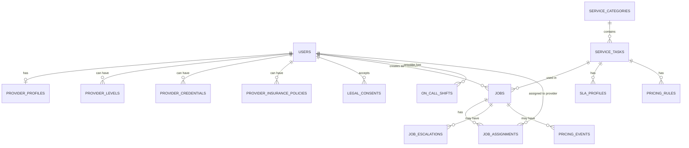

# VISP / TASKER

## Verified Independent Service Provider Platform

### Complete Technical & Business Specification

**Target: iOS Mobile App | Canada (Ontario Focus) & USA**

---

# Table of Contents

1. [Executive Summary](#1-executive-summary)
2. [The 4-Level System](#2-the-4-level-system)
3. [Service Taxonomy](#3-service-taxonomy)
4. [Database Schema](#4-database-schema)
5. [Provider Matching Rules](#5-provider-matching-rules)
6. [Penalties & Incentives](#6-penalties--incentives)
7. [Legal Protection Framework](#7-legal-protection-framework)
8. [Insurance Requirements](#8-insurance-requirements)
9. [Background Check Strategy](#9-background-check-strategy)
10. [Pricing Model](#10-pricing-model)
11. [UX Flows](#11-ux-flows)
12. [Technical Stack](#12-technical-stack)
13. [Critical Business Rules](#13-critical-business-rules)

---

# 1. Executive Summary

## 1.1 What is VISP/Tasker?

VISP (Verified Independent Service Provider), marketed as **Tasker**, is a next-generation home services marketplace that fundamentally reimagines how service providers and clients connect.

> [!IMPORTANT]
> **Core Innovation**: The first platform built with service levels, SLA enforcement, and integrated risk control. Trust by design, not marketing.

## 1.2 Core Value Proposition

| Feature | Description |
|---------|-------------|
| **4-Level System** | Structured progression from Helper → Emergency Pro |
| **SLA Enforcement** | Real-time tracking, auto re-routing, penalty systems |
| **Legal Protection** | Task classification, level limits, reduced liability |
| **Quality Control** | Pre-job verification, not post-failure remediation |
| **Trust Architecture** | Validation before, check-ins during, weighted reviews after |

## 1.3 Key Differentiators vs Competitors

```
┌─────────────────────────────────────────────────────────────┐
│                    COMPETITOR FAILURES                       │
├─────────────────────────────────────────────────────────────┤
│ AskforTask (DEAD): No differentiation, all taskers equal    │
│ TaskRabbit: Single "Tasker" role, weak SLA, quality gaps    │
│ Airtasker: Bidding = race to bottom, inconsistent quality   │
└─────────────────────────────────────────────────────────────┘

┌─────────────────────────────────────────────────────────────┐
│                 TASKER ADVANTAGES                            │
├─────────────────────────────────────────────────────────────┤
│ ✅ 4 distinct provider levels                                │
│ ✅ Real-time SLA enforcement with penalties                  │
│ ✅ Level-specific legal framework                            │
│ ✅ Pre-job verification (not post-incident)                  │
│ ✅ Dedicated emergency tier with on-call system              │
└─────────────────────────────────────────────────────────────┘
```

## 1.4 Platform Positioning

```
TASKER = "The Infrastructure Layer for Home Services"
         "The Operating System for Home Services"
```

**Tasker connects:**

- **Clients**: Landlords, Renters, Homeowners, Contractors
- **With Taskers**: Verified Independent Service Providers (Levels 1-4)

---

# 2. The 4-Level System

> [!NOTE]
> This is the core innovation. Each level has distinct requirements, pricing, commission structures, and legal frameworks.

## 2.1 Level 1 — HELPER (Basic/Non-Regulated)

### Overview

Entry-level tasks requiring minimal training. High volume, low risk, accessible to most providers.

### Role Name: `Helper`

### Requirements

| Requirement | Status |
|-------------|--------|
| Criminal Record Check (CRC) | **MANDATORY** |
| Enhanced Verification (CRJMC) | Optional |
| Vulnerable Sector Check (VSC) | Optional |
| Professional License | Not required |
| Insurance | Recommended, not required |

### Badge Earned

```
✅ "Verified CRC"
```

### Pricing Structure

```json
{
  "hourly_rate_cad": { "min": 25, "max": 45 },
  "platform_commission_pct": { "min": 15, "max": 20 },
  "provider_receives_pct": { "min": 80, "max": 85 },
  "subscription_required": false
}
```

### Included Tasks

- General cleaning (residential, move-in/out, post-construction)
- Furniture assembly (IKEA-style, flat-pack)
- Basic gardening (lawn mowing, weeding, leaf raking)
- Light moving assistance (within same building, small items)
- Snow shoveling (walkways, driveways)
- Pet care (walking, feeding, basic sitting)
- Basic painting (touch-ups, single rooms)
- Errand running (shopping, deliveries)
- Event help (setup, cleanup, serving)

### Strict Exclusions (NEVER PERMITTED)

```diff
- NO electrical work of any kind
- NO plumbing (even faucet replacements)
- NO HVAC or gas-related tasks
- NO structural modifications
- NO work at heights (ladders, roofs)
- NO emergency services
```

---

## 2.2 Level 2 — EXPERIENCED (Technical Light/Non-Regulated)

### Overview

Tasks requiring demonstrable experience but not professional licensing. Technical work within defined boundaries.

### Role Name: `Experienced`

### Requirements

| Requirement | Status |
|-------------|--------|
| Criminal Record Check (CRC) | **MANDATORY** |
| Verified Experience Portfolio | Required (photos, refs, 20+ L1 jobs) |
| Promotion Path | 20 jobs + rating ≥4.5 + no incidents |
| Insurance | Recommended |
| Subscription | Optional: $19-39/month |

### Pricing Structure

```json
{
  "hourly_rate_cad": { "min": 60, "max": 90 },
  "project_based_cad": { "min": 200, "max": 1200 },
  "platform_commission_pct": { "min": 12, "max": 18 },
  "provider_receives_pct": { "min": 82, "max": 88 }
}
```

### Included Tasks

- Drywall repair and patching
- Flooring installation (vinyl planks, laminate - NOT hardwood)
- Door and window adjustments (non-structural)
- Deck and fence repair (cosmetic, non-structural)
- Light carpentry (shelving, trim, baseboards)
- Appliance installation (NO gas or hardwiring)
- Smart home setup (plug-and-play devices)
- Advanced painting (full rooms, exterior, prep work)
- Light plumbing (faucet replacement, toilet repairs)
- Light electrical (outlet/switch replacement, light fixtures)
- Tile work (backsplash, small repairs)
- Pressure washing

### Strict Exclusions

```diff
- NO fixed electrical wiring or panel work
- NO heavy plumbing (main lines, water heaters)
- NO gas line work
- NO HVAC systems
- NO structural work
- NO work requiring permits
- NO emergency services
```

---

## 2.3 Level 3 — CERTIFIED PRO (Regulated/Licensed)

### Overview

Professional, regulated work requiring valid licenses and certifications. High responsibility, strict compliance.

### Role Name: `Certified Pro`

### Requirements

| Requirement | Status |
|-------------|--------|
| Valid Professional License | **MANDATORY** (verified) |
| General Liability Insurance | **MANDATORY** ($2M minimum) |
| Professional Liability Insurance | Recommended |
| Workers Compensation/WSIB | Required if employees |
| Criminal Background Check | **MANDATORY** |
| License Expiry Tracking | Auto-suspension if expired |
| Subscription | $49-99/month |

### Pricing Structure

```json
{
  "hourly_rate_cad": { "min": 90, "max": 150 },
  "project_based_cad": { "min": 500, "max": 5000 },
  "platform_commission_pct": { "min": 8, "max": 12 },
  "provider_receives_pct": { "min": 88, "max": 92 }
}
```

### Included Tasks

- Professional plumbing (water heaters, main lines, renovations)
- Licensed electrical (panel upgrades, rewiring, EV chargers)
- HVAC installation and repair
- Gas line installation and repair
- Structural roofing (full replacement)
- Structural carpentry (load-bearing modifications)
- Mold remediation (certified)
- Asbestos/radon inspection and mitigation
- Full bathroom/kitchen renovations
- Permit-required work

### Exclusions

```diff
- NO emergency services (those are Level 4)
```

---

## 2.4 Level 4 — EMERGENCY ON-CALL PROS

### Overview

Emergency response professionals with 24/7 availability, strict SLA compliance, and premium pricing.

### Role Name: `Emergency On-Call Pro`

### Requirements

| Requirement | Status |
|-------------|--------|
| All Level 3 Certifications | **MANDATORY** |
| Extended Emergency Insurance | **MANDATORY** |
| Documented On-Call Availability | **MANDATORY** |
| SLA Compliance History | Required |
| Active On-Call Shift Registration | Required |
| Response Tracking Device/App | Required |
| Internal Score | Minimum 70 |
| Subscription | $99-199/month |

### Emergency Categories

```
🔹 Burst pipes / Flooding
🔹 Total power loss / Electrical emergency
🔹 No heat (extreme weather)
🔹 Gas leaks (suspected or confirmed)
🔹 Storm damage (structural, water intrusion)
🔹 Fire damage (immediate response)
🔹 Structural emergencies (collapse risk)
```

### SLA Requirements

| Metric | Requirement | Penalty if Breached |
|--------|-------------|---------------------|
| Response Time | ≤15-45 minutes | -30 score points |
| Arrival Time | ≤60-120 minutes | Job reassignment |
| Coverage | 24/7 during active shift | Shift suspension |
| No-Show | Zero tolerance | -50 points, expulsion risk |

### Pricing Structure

```json
{
  "base_callout_fee_cad": 150,
  "hourly_rate_cad": { "min": 120, "max": 250 },
  "dynamic_multipliers": {
    "night_hours_10pm_6am": 1.5,
    "extreme_weather": 2.0,
    "peak_demand_holidays": 2.5
  },
  "platform_commission_pct": { "min": 15, "max": 25 },
  "provider_receives_pct": { "min": 75, "max": 85 },
  "on_call_stipend_available": true
}
```

---

# 3. Service Taxonomy

> [!NOTE]
> 200+ services categorized by level. This forms the `service_tasks` table.

## 3.1 Plumbing Services

| Task | Level |
|------|-------|
| Faucet replacement | 2 |
| Toilet repairs (flapper, fill valve) | 2 |
| Sink installation | 2 |
| Garbage disposal replacement | 2 |
| Drain cleaning (manual snake) | 2 |
| Water heater installation | 3 |
| Main water line repair | 3 |
| Sewer line repair | 3 |
| Bathroom renovation plumbing | 3 |
| Sump pump installation | 3 |
| Gas line plumbing | 3 |
| Burst pipe emergency | 4 |
| Flooding mitigation | 4 |
| Sewer backup emergency | 4 |

## 3.2 Electrical Services

| Task | Level |
|------|-------|
| Light fixture replacement | 2 |
| Outlet cover replacement | 2 |
| Switch replacement | 2 |
| Ceiling fan installation | 2 |
| Dimmer switch installation | 2 |
| Panel upgrade | 3 |
| New circuit installation | 3 |
| Whole house rewiring | 3 |
| EV charger installation | 3 |
| Total power loss diagnosis | 4 |
| Panel fire/damage | 4 |

## 3.3 HVAC Services

| Task | Level |
|------|-------|
| Furnace installation | 3 |
| AC unit installation | 3 |
| Heat pump installation | 3 |
| Ductwork repair | 3 |
| No heat emergency | 4 |
| Gas leak response | 4 |
| CO alarm response | 4 |

## 3.4 General Services (Level 1)

```
✓ Residential cleaning
✓ Furniture assembly
✓ Lawn mowing / yard work
✓ Snow shoveling
✓ Pet walking/sitting
✓ Errand running
✓ Event setup/cleanup
✓ Basic painting
✓ Light moving assistance
✓ Organizing/decluttering
✓ Holiday decoration installation
```

## 3.5 Technical Light Services (Level 2)

```
✓ Drywall repair/patching
✓ Flooring installation (vinyl, laminate)
✓ Interior/exterior painting
✓ Deck/fence repair
✓ Shelving/storage installation
✓ Tile work (backsplash)
✓ Appliance installation (no gas)
✓ Pressure washing
✓ TV mounting
✓ Smart home setup
```

---

# 4. Database Schema

## 4.1 Enums/Constants

```sql
-- Service Levels
CREATE TYPE service_level AS ENUM ('L1_BASIC', 'L2_TECH_LIGHT', 'L3_CERTIFIED', 'L4_EMERGENCY');

-- Job Status
CREATE TYPE job_status AS ENUM (
  'DRAFT', 'REQUESTED', 'MATCHING', 'ASSIGNED', 
  'EN_ROUTE', 'ARRIVED', 'IN_PROGRESS', 
  'COMPLETED', 'CANCELLED', 'DISPUTED'
);

-- Provider Availability
CREATE TYPE provider_availability AS ENUM ('OFFLINE', 'ONLINE', 'ON_CALL', 'BUSY');

-- Verification Status
CREATE TYPE verification_status AS ENUM ('UNVERIFIED', 'PENDING', 'VERIFIED', 'REJECTED', 'EXPIRED');

-- Background Check Type
CREATE TYPE background_check_type AS ENUM ('CRC', 'CRJMC', 'VSC');

-- Price Model
CREATE TYPE price_model AS ENUM ('HOURLY', 'FIXED', 'HYBRID', 'DYNAMIC');
```

## 4.2 Core Tables

### users

```sql
CREATE TABLE users (
  id UUID PRIMARY KEY DEFAULT gen_random_uuid(),
  email VARCHAR(255) UNIQUE NOT NULL,
  phone VARCHAR(20),
  first_name VARCHAR(100),
  last_name VARCHAR(100),
  role_customer BOOLEAN DEFAULT FALSE,
  role_provider BOOLEAN DEFAULT FALSE,
  status VARCHAR(20) DEFAULT 'active', -- active, suspended, banned
  created_at TIMESTAMP DEFAULT NOW(),
  updated_at TIMESTAMP DEFAULT NOW()
);
```

### provider_profiles

```sql
CREATE TABLE provider_profiles (
  provider_id UUID PRIMARY KEY REFERENCES users(id),
  bio TEXT,
  photo_url VARCHAR(500),
  avg_rating DECIMAL(3,2) DEFAULT 0.00,
  total_jobs_completed INTEGER DEFAULT 0,
  availability_status provider_availability DEFAULT 'OFFLINE',
  home_city VARCHAR(100),
  service_radius_km INTEGER DEFAULT 25,
  background_check_status verification_status DEFAULT 'UNVERIFIED',
  background_check_type background_check_type,
  background_check_verified_at TIMESTAMP,
  internal_score INTEGER DEFAULT 70 CHECK (internal_score BETWEEN 0 AND 100),
  -- IMPORTANT: internal_score is NOT visible to provider
  created_at TIMESTAMP DEFAULT NOW()
);
```

### provider_levels

```sql
CREATE TABLE provider_levels (
  id UUID PRIMARY KEY DEFAULT gen_random_uuid(),
  provider_id UUID REFERENCES users(id),
  level service_level NOT NULL,
  status verification_status DEFAULT 'PENDING',
  approved_at TIMESTAMP,
  expires_at TIMESTAMP, -- nullable for L1-L2
  verification_notes TEXT,
  UNIQUE(provider_id, level)
);
```

## 4.3 Service Taxonomy Tables

### service_categories

```sql
CREATE TABLE service_categories (
  id UUID PRIMARY KEY DEFAULT gen_random_uuid(),
  name VARCHAR(100) NOT NULL, -- "Plumbing", "Electrical", "Cleaning"
  icon_key VARCHAR(50),
  sort_order INTEGER DEFAULT 0,
  active BOOLEAN DEFAULT TRUE
);
```

### service_tasks (CRITICAL TABLE)

```sql
CREATE TABLE service_tasks (
  id UUID PRIMARY KEY DEFAULT gen_random_uuid(),
  category_id UUID REFERENCES service_categories(id),
  name VARCHAR(200) NOT NULL, -- "Faucet Replacement"
  description TEXT,
  level service_level NOT NULL,
  regulated BOOLEAN DEFAULT FALSE,
  license_required VARCHAR(100), -- specific license type
  insurance_required BOOLEAN DEFAULT FALSE,
  hazardous BOOLEAN DEFAULT FALSE,
  structural BOOLEAN DEFAULT FALSE,
  emergency_eligible BOOLEAN DEFAULT FALSE,
  estimated_duration_min INTEGER,
  keywords TEXT[], -- for escalation detection
  active BOOLEAN DEFAULT TRUE
);
```

## 4.4 Verification Tables

### provider_credentials

```sql
CREATE TABLE provider_credentials (
  id UUID PRIMARY KEY DEFAULT gen_random_uuid(),
  provider_id UUID REFERENCES users(id),
  credential_type VARCHAR(50), -- license, certification, training
  credential_name VARCHAR(200), -- "Master Electrician"
  license_number VARCHAR(100),
  issuing_authority VARCHAR(200),
  issued_at DATE,
  expires_at DATE,
  document_url VARCHAR(500), -- S3 path
  status verification_status DEFAULT 'PENDING',
  verified_at TIMESTAMP,
  verified_by VARCHAR(100)
);
```

### provider_insurance_policies

```sql
CREATE TABLE provider_insurance_policies (
  id UUID PRIMARY KEY DEFAULT gen_random_uuid(),
  provider_id UUID REFERENCES users(id),
  policy_type VARCHAR(50), -- general_liability, professional_liability, extended_emergency, workers_comp
  policy_number VARCHAR(100),
  insurer_name VARCHAR(200),
  coverage_amount DECIMAL(12,2),
  effective_date DATE,
  expires_at DATE,
  document_url VARCHAR(500),
  status VARCHAR(20) DEFAULT 'active', -- active, expired, cancelled
  verified_at TIMESTAMP
);
```

### legal_consents (AUDIT TABLE)

```sql
CREATE TABLE legal_consents (
  id UUID PRIMARY KEY DEFAULT gen_random_uuid(),
  user_id UUID REFERENCES users(id),
  consent_type VARCHAR(100), -- "level_1_terms", "emergency_sla"
  version VARCHAR(20), -- "v2.1"
  accepted_at TIMESTAMP DEFAULT NOW(),
  ip_address INET,
  user_agent TEXT,
  consent_text_hash VARCHAR(64) -- SHA256 of terms at acceptance
);
```

## 4.5 Job Management Tables

### jobs

```sql
CREATE TABLE jobs (
  id UUID PRIMARY KEY DEFAULT gen_random_uuid(),
  customer_id UUID REFERENCES users(id),
  service_task_id UUID REFERENCES service_tasks(id),
  level service_level NOT NULL, -- copied from service_task
  status job_status DEFAULT 'DRAFT',
  is_emergency BOOLEAN DEFAULT FALSE,
  priority VARCHAR(20) DEFAULT 'normal', -- normal, urgent, emergency
  
  -- Location
  location_address TEXT,
  location_lat DECIMAL(10,8),
  location_lng DECIMAL(11,8),
  
  -- Scheduling
  scheduled_at TIMESTAMP,
  
  -- SLA (snapshot at creation)
  sla_response_minutes INTEGER,
  sla_arrival_minutes INTEGER,
  
  -- Duration & Pricing
  estimated_duration INTEGER, -- minutes
  estimated_total DECIMAL(10,2),
  final_total DECIMAL(10,2),
  platform_commission DECIMAL(10,2),
  provider_payout DECIMAL(10,2),
  
  created_at TIMESTAMP DEFAULT NOW(),
  updated_at TIMESTAMP DEFAULT NOW()
);
```

### job_assignments

```sql
CREATE TABLE job_assignments (
  id UUID PRIMARY KEY DEFAULT gen_random_uuid(),
  job_id UUID REFERENCES jobs(id),
  provider_id UUID REFERENCES users(id),
  
  -- Timestamps
  assigned_at TIMESTAMP DEFAULT NOW(),
  accepted_at TIMESTAMP,
  rejected_at TIMESTAMP,
  rejection_reason VARCHAR(200),
  en_route_at TIMESTAMP,
  arrived_at TIMESTAMP,
  started_at TIMESTAMP,
  completed_at TIMESTAMP,
  
  -- SLA Tracking
  sla_response_met BOOLEAN,
  sla_arrival_met BOOLEAN,
  sla_breached BOOLEAN DEFAULT FALSE,
  breach_reason VARCHAR(200)
);
```

### job_escalations

```sql
CREATE TABLE job_escalations (
  id UUID PRIMARY KEY DEFAULT gen_random_uuid(),
  job_id UUID REFERENCES jobs(id),
  from_level service_level,
  to_level service_level,
  reason_code VARCHAR(50), -- keyword_detected, provider_flagged, customer_request
  detected_keywords TEXT[],
  escalated_at TIMESTAMP DEFAULT NOW(),
  status VARCHAR(20) DEFAULT 'pending', -- pending, approved, rejected
  resolved_by UUID REFERENCES users(id)
);
```

## 4.6 SLA & Emergency Tables

### sla_profiles

```sql
CREATE TABLE sla_profiles (
  id UUID PRIMARY KEY DEFAULT gen_random_uuid(),
  service_task_id UUID REFERENCES service_tasks(id),
  region_key VARCHAR(50), -- "ontario", "gta", "rural_on"
  response_minutes INTEGER NOT NULL,
  arrival_minutes INTEGER NOT NULL,
  coverage_hours_json JSONB, -- {"mon": "00:00-24:00"}
  active BOOLEAN DEFAULT TRUE
);
```

### on_call_shifts

```sql
CREATE TABLE on_call_shifts (
  id UUID PRIMARY KEY DEFAULT gen_random_uuid(),
  provider_id UUID REFERENCES users(id),
  region_key VARCHAR(50),
  starts_at TIMESTAMP NOT NULL,
  ends_at TIMESTAMP NOT NULL,
  status VARCHAR(20) DEFAULT 'scheduled', -- scheduled, active, completed, cancelled, no_show
  stipend_amount DECIMAL(8,2),
  jobs_received INTEGER DEFAULT 0,
  jobs_completed INTEGER DEFAULT 0
);
```

## 4.7 Pricing Tables

### pricing_rules

```sql
CREATE TABLE pricing_rules (
  id UUID PRIMARY KEY DEFAULT gen_random_uuid(),
  service_task_id UUID REFERENCES service_tasks(id),
  level service_level,
  region_key VARCHAR(50),
  price_model price_model DEFAULT 'HOURLY',
  base_rate DECIMAL(8,2),
  min_charge DECIMAL(8,2),
  max_charge DECIMAL(8,2),
  platform_commission_pct DECIMAL(5,2),
  dynamic_multiplier_min DECIMAL(3,2) DEFAULT 1.0,
  dynamic_multiplier_max DECIMAL(3,2) DEFAULT 3.0,
  active BOOLEAN DEFAULT TRUE
);
```

### pricing_events

```sql
CREATE TABLE pricing_events (
  id UUID PRIMARY KEY DEFAULT gen_random_uuid(),
  job_id UUID REFERENCES jobs(id),
  reason VARCHAR(50), -- night_hours, weekend, holiday, extreme_weather, surge_demand, emergency
  multiplier DECIMAL(3,2),
  applied_at TIMESTAMP DEFAULT NOW(),
  source VARCHAR(50) -- weather_api, demand_algorithm, manual
);
```

---

# 5. Provider Matching Rules

## 5.1 Level 1 & 2 Matching

```sql
-- Pseudo-SQL for matching logic
SELECT p.* FROM providers p
JOIN provider_levels pl ON p.id = pl.provider_id
WHERE pl.status = 'VERIFIED'
  AND p.availability_status = 'ONLINE'
  AND pl.level >= :requested_level
  AND p.background_check_status = 'VERIFIED'
  AND p.internal_score >= :level_min_score
  AND ST_DWithin(p.location, :job_location, p.service_radius_km * 1000)
ORDER BY p.internal_score DESC, p.avg_rating DESC;
```

## 5.2 Level 3 Matching (Additional)

```sql
-- All Level 1-2 requirements PLUS:
AND EXISTS (
  SELECT 1 FROM provider_insurance_policies pip
  WHERE pip.provider_id = p.id
    AND pip.policy_type = 'general_liability'
    AND pip.status = 'active'
    AND pip.expires_at > NOW()
)
AND EXISTS (
  SELECT 1 FROM provider_credentials pc
  WHERE pc.provider_id = p.id
    AND pc.status = 'VERIFIED'
    AND pc.expires_at > NOW()
    AND pc.credential_type = :required_license
)
```

## 5.3 Level 4 Matching (Emergency)

```sql
-- All Level 3 requirements PLUS:
AND p.availability_status = 'ON_CALL'
AND EXISTS (
  SELECT 1 FROM on_call_shifts ocs
  WHERE ocs.provider_id = p.id
    AND ocs.status = 'active'
    AND NOW() BETWEEN ocs.starts_at AND ocs.ends_at
    AND ocs.region_key = :job_region
)
AND EXISTS (
  SELECT 1 FROM provider_insurance_policies pip
  WHERE pip.provider_id = p.id
    AND pip.policy_type = 'extended_emergency'
    AND pip.status = 'active'
)
AND p.internal_score >= 70
AND NOT EXISTS (
  SELECT 1 FROM job_assignments ja
  JOIN jobs j ON ja.job_id = j.id
  WHERE ja.provider_id = p.id
    AND ja.sla_breached = TRUE
    AND ja.completed_at > NOW() - INTERVAL '30 days'
)
```

---

# 6. Penalties & Incentives

## 6.1 Internal Score System

> [!IMPORTANT]
> The internal score (0-100) affects provider visibility, job assignment priority, and level retention. **This score is NOT visible to providers.**

### Score Ranges by Level

| Level | Base Score | Min Score | Max Score |
|-------|------------|-----------|-----------|
| Level 1 | 70 | 40 | 90 |
| Level 2 | 75 | 50 | 95 |
| Level 3 | 80 | 60 | 98 |
| Level 4 | 85 | 70 | 100 |

## 6.2 Penalty Structure

### Level 1 (Educational, Tolerant)

| Fault | Penalty | Consequence |
|-------|---------|-------------|
| Response timeout | -2 points | Visibility reduction |
| Job cancellation | -3 points | Priority drop |
| No-show | -10 points | Warning |
| Negative review (≤2 stars) | -5 points | Flag for review |

### Level 2 (Reliability Focus)

| Fault | Penalty | Consequence |
|-------|---------|-------------|
| Response timeout | -4 points | 6h priority drop |
| Job cancellation | -6 points | 12h block |
| Late arrival (>15 min) | -5 points | Warning |
| No-show | -15 points | 24-48h block |
| Negative review | -7 points | Review flag |

### Level 3 (Strict Compliance)

| Fault | Penalty | Consequence |
|-------|---------|-------------|
| Response timeout | -6 points | 12h block |
| Job cancellation | -10 points | 24h block |
| SLA breach | -15 points | Level review |
| No-show | -30 points | Suspension pending review |
| Documentation expired | Score set to 60 | Auto-suspension |

### Level 4 (Zero Tolerance)

| Fault | Penalty | Consequence |
|-------|---------|-------------|
| Response timeout (on-call) | -15 points | Immediate review |
| Job cancellation | -25 points | 48h suspension |
| SLA breach | -30 points | Level 4 probation |
| No-show | -50 points | **IMMEDIATE L4 EXPULSION** |

## 6.3 Incentive Structure

### Level Advancement

- **Level 1 → Level 2**: 20 jobs + rating ≥4.5 + no incidents
- **Level 2 → Level 3**: License verification + insurance + history
- **Level 3 → Level 4**: SLA track record + emergency insurance

### Performance Rewards

| Achievement | Reward |
|-------------|--------|
| 5 jobs without incidents | +5 points |
| Response time <3 min | Visibility boost |
| 10 jobs, rating ≥4.7 | +7 points |
| Perfect SLA (10 jobs) | +10 points, commission discount |

## 6.4 Auto-Normalization

```
Every 7 days without incidents:
  provider.internal_score += 5
  (capped at level's base score)
```

This prevents permanent punishment and encourages recovery.

---

# 7. Legal Protection Framework

## 7.1 Core Legal Position

> [!CAUTION]
> **CRITICAL**: Tasker is a technology platform that connects independent service providers with customers. Tasker is NOT an employer and does NOT perform services itself.

### Platform Role

```
┌────────────────────────────────────────────────┐
│              TASKER LEGAL POSITION              │
├────────────────────────────────────────────────┤
│ ✅ Technology platform / intermediary           │
│ ✅ Facilitates connections                      │
│ ✅ Processes payments                           │
│ ✅ Verifies credentials                         │
│ ❌ Does NOT employ providers                    │
│ ❌ Does NOT supervise work execution            │
│ ❌ Does NOT guarantee results                   │
│ ❌ Does NOT assume professional liability       │
└────────────────────────────────────────────────┘
```

## 7.2 Required Legal Consents

| Consent Type | Description | Required For |
|--------------|-------------|--------------|
| platform_tos | General platform terms | All users |
| provider_ic_agreement | Independent contractor acknowledgment | All providers |
| level_1_terms | Level 1 limitations | Level 1 providers |
| level_2_terms | Level 2 limitations | Level 2 providers |
| level_3_terms | Licensing requirements | Level 3 providers |
| level_4_emergency_sla | Emergency SLA commitments | Level 4 providers |
| customer_service_agreement | Platform role acknowledgment | All customers |
| emergency_pricing_consent | Dynamic pricing acknowledgment | Emergency jobs |

## 7.3 Job-Level Legal Checkboxes

### Provider Acknowledgments (Before Every Job)

```
☐ "I understand this task is limited to [TASK_NAME] only"
☐ "I will not perform any electrical work" (if applicable)
☐ "I will not perform any gas-related work" (if applicable)
☐ "I will not perform any work requiring a permit"
☐ "I am acting as an independent contractor, not an employee of Tasker"
```

### Customer Acknowledgments

```
☐ "I understand Tasker connects me with independent service providers"
☐ "I understand Tasker does not perform the service itself"
☐ "I understand the service is limited to [TASK_NAME]"
☐ "I accept the estimated pricing and understand final cost may vary"
```

## 7.4 Auto-Escalation System

**Trigger Keywords** (detected in messages or notes):

```
["electrical", "gas", "plumbing", "structural", "permit", 
 "wiring", "panel", "hvac", "main line", "load-bearing"]
```

**Escalation Flow**:

```
1. Keyword detected → Create job_escalations record
2. Block job assignment
3. Notify admin for review
4. Re-match with appropriate level provider
5. Log entire escalation chain
```

---

# 8. Insurance Requirements

## 8.1 Platform Insurance (Tasker Must Carry)

### Mandatory Platform Coverage

| Coverage Type | Min Amount | Est. Annual Cost |
|---------------|------------|------------------|
| Commercial General Liability (CGL) | $2M | $450-1,500 |
| Contingent/On-Task CGL | Per incident | Variable |
| Errors & Omissions (E&O) | $1M | $500-2,000 |
| Cyber Liability | $1M | $500-1,500 |

### Recommended Platform Coverage

- Occupational Accident Insurance
- Crime/Fidelity Insurance
- Contingent Auto Liability
- Directors & Officers (D&O)

## 8.2 Provider Insurance by Level

| Insurance Type | L1-L2 | L3 | L4 |
|----------------|-------|----|----|
| General Liability | Optional | **MANDATORY** | **MANDATORY** |
| Professional Liability | N/A | Recommended | **MANDATORY** |
| Extended Emergency | N/A | N/A | **MANDATORY** |
| Workers' Comp/WSIB | N/A | If employees | If employees |

---

# 9. Background Check Strategy

## 9.1 Three Levels of Checks (Ontario)

### Level 1: Criminal Record Check (CRC) — MANDATORY

```
✓ Basic criminal record search
✓ Badge: "Verified CRC"
✓ Cost: $25-50
✓ Processing: 1-5 business days
✓ Can be done via third-party providers
```

### Level 2: Criminal + Judicial Matters (CRJMC) — OPTIONAL

```
✓ CRC plus outstanding charges, judicial orders, peace bonds
✓ Badge: "Enhanced Verification"
✓ Recommended for: Access to financial info, sensitive data
✓ Cost: $35-75
```

### Level 3: Vulnerable Sector Check (VSC) — OPTIONAL

```
✓ Most comprehensive (includes pardoned sexual offenses)
✓ Badge: "Vulnerable Sector Verified"
✓ Required for: Work with children, elderly, disabled
✓ MUST be done through police services (NO third-party)
✓ Cost: $50-90
✓ Processing: 2-8 weeks
```

## 9.2 Approved Verification Providers

### Government/Police Services

- Ontario Provincial Police (OPP)
- Toronto Police Service
- Peel Regional Police
- Hamilton Police Service
- Local police services throughout Ontario

### Approved Third-Party Providers (CRC/CRJMC only)

- CRJMC.net
- TritonCanada.ca
- MyCRC.ca
- Sterling Backcheck

---

# 10. Pricing Model

## 10.1 Commission Structure by Level

| Level | Client Rate | Platform Commission | Provider Receives |
|-------|-------------|---------------------|-------------------|
| Level 1 | $25-45/hr | 15-20% | 80-85% |
| Level 2 | $60-90/hr | 12-18% | 82-88% |
| Level 3 | $90-150/hr | 8-12% | 88-92% |
| Level 4 | $120-250/hr + $150 base | 15-25% | 75-85% |

## 10.2 Dynamic Pricing (Level 4 Emergency)

```json
{
  "multipliers": {
    "night_hours": 1.5,      // 10pm - 6am
    "weekend": 1.25,
    "holiday": 2.0,
    "extreme_weather": 2.0,
    "surge_demand": 1.5,
    "max_cap": 3.0
  }
}
```

## 10.3 Subscription Tiers

| Tier | Level Access | Monthly Cost | Benefits |
|------|--------------|--------------|----------|
| Free | Level 1 | $0 | Basic access |
| Pro | Level 2 | $19-39 | Priority matching, lower fees |
| Certified | Level 3 | $49-99 | License hosting, featured badge |
| Emergency | Level 4 | $99-199 | On-call access, stipends |

## 10.4 Fee Structure

### Additional Fees

- Emergency callout fee: $150 (goes to provider)
- Booking fee (customer): $3.99-9.99
- Rush booking fee: $15-25
- Late-night fee: Included in multiplier

---

# 11. UX Flows

## 11.1 Emergency Flow (Level 4) — 11 Screens

```
┌─────────────────────────────────────────────────────────┐
│  SCREEN 1: HOME                                          │
│  ┌─────────────────────────────────────────────────┐    │
│  │      🚨 Emergency Service (RED BUTTON)           │    │
│  │      Immediate help · Certified pros · SLA       │    │
│  └─────────────────────────────────────────────────┘    │
└─────────────────────────────────────────────────────────┘
                            ↓
┌─────────────────────────────────────────────────────────┐
│  SCREEN 2: EMERGENCY SELECTION (CLOSED CARDS)            │
│  ┌─────┐ ┌─────┐ ┌─────┐                                 │
│  │ 💧  │ │ ⚡  │ │ 🔥  │                                 │
│  │Burst│ │ No  │ │ No  │                                 │
│  │Pipe │ │Power│ │Heat │                                 │
│  └─────┘ └─────┘ └─────┘                                 │
│  ┌─────┐ ┌─────┐ ┌─────┐                                 │
│  │ ⛽  │ │ 🌪️  │ │ 🔥  │                                 │
│  │ Gas │ │Storm│ │Fire │                                 │
│  │Leak │ │     │ │     │                                 │
│  └─────┘ └─────┘ └─────┘                                 │
│  ⚠️ NO FREE TEXT INPUT (legal protection)                │
└─────────────────────────────────────────────────────────┘
                            ↓
┌─────────────────────────────────────────────────────────┐
│  SCREEN 3: RISK CONFIRMATION (LEGAL)                     │
│  ⚠️ Emergency Confirmation                               │
│  This is an urgent, high-risk service requiring a        │
│  certified professional and emergency pricing.           │
│                                                          │
│  ☐ I understand this is an emergency service with        │
│    premium pricing and SLA. [MANDATORY]                  │
│                    [Continue]                            │
└─────────────────────────────────────────────────────────┘
                            ↓
┌─────────────────────────────────────────────────────────┐
│  SCREEN 4: LOCATION & ACCESS                             │
│  📍 2059 Deer Run Ave, Toronto, ON                       │
│                                                          │
│  Is someone home?        [YES] [NO]                      │
│  Can provider access?    [YES] [NO]                      │
│  Access instructions: ___________                        │
└─────────────────────────────────────────────────────────┘
                            ↓
┌─────────────────────────────────────────────────────────┐
│  SCREEN 5: SLA + PRICING                                 │
│  🚨 Emergency Response Guarantee                         │
│  ┌────────────────────────────────────────────────┐     │
│  │ ⏱️ Response: ≤ 45 minutes                       │     │
│  │ 🚗 Arrival: ≤ 90 minutes                        │     │
│  │ 👷 Certified Professional                       │     │
│  │ 📞 On-Call                                      │     │
│  └────────────────────────────────────────────────┘     │
│  Estimated: $180 - $350 (Night rate: 1.5x)              │
│                                                          │
│  ☐ I accept the SLA and emergency pricing [MANDATORY]   │
└─────────────────────────────────────────────────────────┘
                            ↓
┌─────────────────────────────────────────────────────────┐
│  SCREEN 6: REAL-TIME MATCHING                            │
│         🔍 Finding emergency professional...             │
│              [Animated search graphic]                   │
│                                                          │
│              [Cancel Button]                             │
└─────────────────────────────────────────────────────────┘
                            ↓
┌─────────────────────────────────────────────────────────┐
│  SCREEN 7: PROVIDER ASSIGNED                             │
│  ┌─────────────────────────────────────────┐            │
│  │  [PHOTO]  John M.                        │            │
│  │           ⭐ 4.9 (127 emergency jobs)    │            │
│  │           ✅ Licensed Plumber            │            │
│  │           ✅ VISP Verified               │            │
│  │           ETA: 25 minutes                │            │
│  └─────────────────────────────────────────┘            │
│            [📞 Contact]  [📍 Track]                     │
└─────────────────────────────────────────────────────────┘
                            ↓
┌─────────────────────────────────────────────────────────┐
│  SCREEN 8: LIVE TRACKING                                 │
│  ┌─────────────────────────────────────────────────┐    │
│  │                   [MAP]                          │    │
│  │            🚗 → → → 📍                          │    │
│  │                                                  │    │
│  └─────────────────────────────────────────────────┘    │
│  John is on the way · ETA 18 min                        │
│             [📞 Call]  [💬 Message]                     │
└─────────────────────────────────────────────────────────┘
                            ↓
┌─────────────────────────────────────────────────────────┐
│  SCREEN 9: SERVICE START                                 │
│  ┌─────────────────────────────────────────────────┐    │
│  │         ▶️ Start Emergency Service               │    │
│  └─────────────────────────────────────────────────┘    │
│  (Provider initiates - job timer begins)                │
└─────────────────────────────────────────────────────────┘
                            ↓
┌─────────────────────────────────────────────────────────┐
│  SCREEN 10: IN PROGRESS                                  │
│  Status: 🔴 IN PROGRESS                                  │
│  Timer: 00:47:23                                         │
│  Running cost: $215.50                                   │
│  ┌──────────────────────┐ ┌──────────────────────┐      │
│  │  ⚠️ Escalate Issue   │ │  🛑 Stop Service     │      │
│  └──────────────────────┘ └──────────────────────┘      │
└─────────────────────────────────────────────────────────┘
                            ↓
┌─────────────────────────────────────────────────────────┐
│  SCREEN 11: COMPLETION & RATING                          │
│  ✅ Service Completed                                    │
│  ───────────────────────────────                        │
│  Time: 1h 23min                                          │
│  Materials: $45.00                                       │
│  Labor: $207.00                                          │
│  Total: $252.00                                          │
│  ───────────────────────────────                        │
│  Rate your experience: ⭐⭐⭐⭐⭐                        │
│  [Optional feedback: ____________]                       │
│  ───────────────────────────────                        │
│  ℹ️ Tasker acts as platform intermediary only.          │
│             [✓ Complete & Pay]                          │
└─────────────────────────────────────────────────────────┘
```

## 11.2 Critical UX Rules

```diff
+ Closed task selection ONLY from service_tasks catalog
+ Mandatory legal checkboxes per level
+ SLA timers always visible for emergency jobs
+ Auto-escalation if task exceeds level capability

- NO free text fields for task description (legal risk)
- Provider CANNOT offer additional services
- Provider CANNOT modify task scope
- NO ambiguous service categories
```

---

# 12. Technical Stack

## 12.1 Backend Architecture

| Component | Technology |
|-----------|------------|
| Language | Python 3.11+ |
| Framework | FastAPI (async) |
| ORM | SQLAlchemy 2.0 |
| Migrations | Alembic |
| Validation | Pydantic v2 |
| Authentication | OAuth2 + JWT |
| Background Jobs | Celery + Redis |

## 12.2 Database

| Purpose | Technology |
|---------|------------|
| Primary DB | PostgreSQL 15 (AWS RDS) |
| Caching | Redis (ElastiCache) |
| Search | Elasticsearch |
| Geospatial | PostGIS extension |

## 12.3 Storage

| Purpose | Technology |
|---------|------------|
| Documents | AWS S3 |
| Images | S3 + CloudFront CDN |
| Structured Data | PostgreSQL |

## 12.4 Mobile & Web

| Platform | Technology |
|----------|------------|
| iOS App | React Native |
| Web Admin | React + TypeScript + Next.js |
| Real-time | WebSockets (Socket.io) |
| Maps | Google Maps API / Mapbox |

## 12.5 Infrastructure

| Component | Technology |
|-----------|------------|
| Compute | AWS ECS Fargate |
| API Gateway | AWS API Gateway |
| Load Balancing | AWS ALB |
| Monitoring | CloudWatch + Grafana |
| Secrets | AWS Secrets Manager |
| CI/CD | GitHub Actions |

---

# 13. Critical Business Rules

> [!CAUTION]
> These rules are NON-NEGOTIABLE and must be enforced at both application and database levels.

## Rule 1: Closed Task Catalog

```
Clients select from predefined service_task_id.
NO free text task descriptions allowed.
Essential for legal protection and proper level matching.
```

## Rule 2: Levels as Business Rule

```
service_tasks.level and provider_levels.level must match.
System only matches providers where level >= task level.
Enforced at query time.
```

## Rule 3: Auditable Legal Consents

```
Every consent logged in legal_consents with:
- Version
- Timestamp
- IP address
- Content hash (SHA256)
Creates immutable audit trail.
```

## Rule 4: SLA Snapshot

```
SLA terms copied to job record at creation time.
Disputes judged by terms in effect at job start.
```

## Rule 5: Auto-Escalation

```
Keywords trigger automatic escalation review.
System creates job_escalations record.
Admin approval required to proceed.
```

## Rule 6: Provider Cannot Decide Scope

```
Providers cannot:
- Offer additional services
- Modify task scope
- "Help a little extra"
Any scope change requires new job request.
```

## Rule 7: Automatic Qualification Blocks

```
If task requires qualifications provider doesn't have:
- Expired license
- Missing insurance
System automatically blocks assignment.
NO manual override available.
```

---

# Appendix A: Entity Relationship Diagram



---

# Appendix B: Level Comparison Matrix

| Aspect | Level 1 | Level 2 | Level 3 | Level 4 |
|--------|---------|---------|---------|---------|
| Role Name | Helper | Experienced | Certified Pro | Emergency Pro |
| Background Check | CRC | CRC | CRC + License | CRC + License |
| Insurance | Optional | Recommended | Mandatory | Extended Mandatory |
| License Required | No | No | Yes | Yes |
| Subscription | Free | $19-39 | $49-99 | $99-199 |
| Hourly Rate | $25-45 | $60-90 | $90-150 | $120-250+ |
| Commission | 15-20% | 12-18% | 8-12% | 15-25% |
| SLA | None | Soft | Standard | Strict + Penalties |
| On-Call | No | No | No | Yes |
| Emergency | No | No | No | Yes |
| Min Score | 40 | 50 | 60 | 70 |

---

**Document Version**: 1.0
**Last Updated**: February 2026
**Classification**: Technical Specification
**Audience**: Development Team, AI Sub-Agents, Architecture Review
